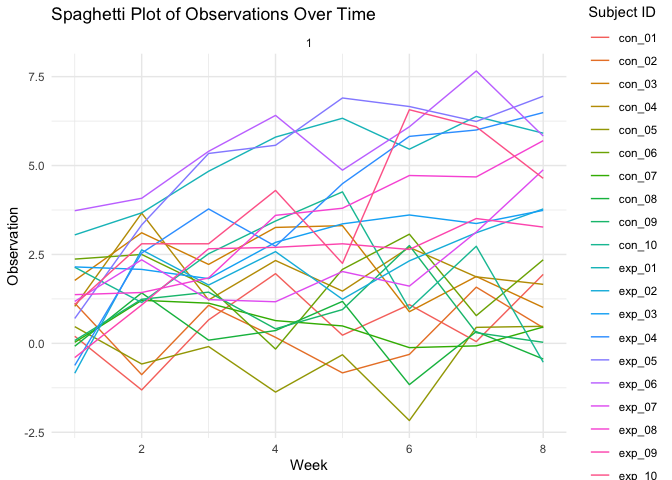
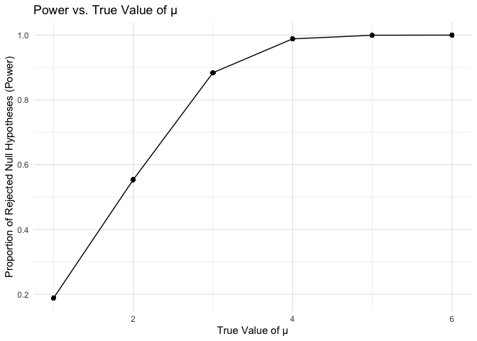
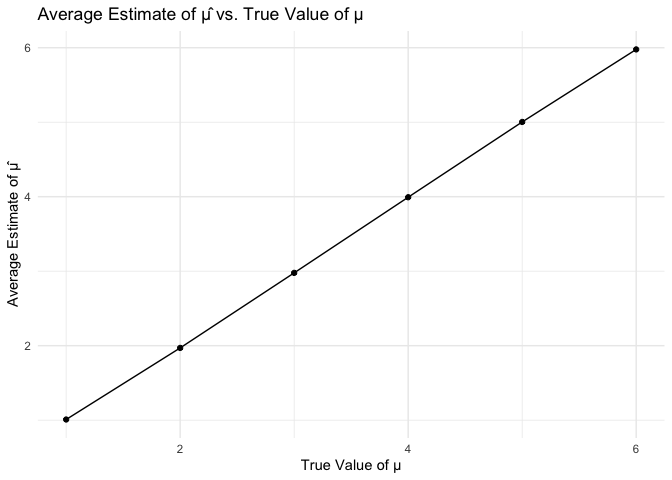
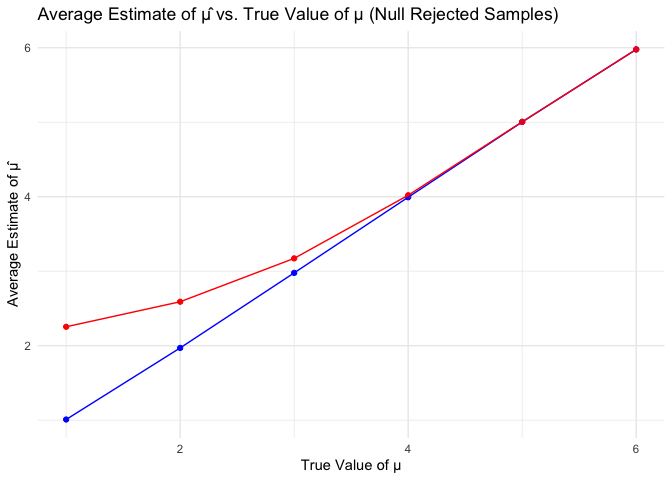

hw5
================
Tongxi Yu
2023-11-12

``` r
library("purrr")
library("dplyr")
```

    ## 
    ## Attaching package: 'dplyr'

    ## The following objects are masked from 'package:stats':
    ## 
    ##     filter, lag

    ## The following objects are masked from 'package:base':
    ## 
    ##     intersect, setdiff, setequal, union

``` r
library("tidyverse")
```

    ## ── Attaching core tidyverse packages ──────────────────────── tidyverse 2.0.0 ──
    ## ✔ forcats   1.0.0     ✔ stringr   1.5.0
    ## ✔ ggplot2   3.4.3     ✔ tibble    3.2.1
    ## ✔ lubridate 1.9.2     ✔ tidyr     1.3.0
    ## ✔ readr     2.1.4

    ## ── Conflicts ────────────────────────────────────────── tidyverse_conflicts() ──
    ## ✖ dplyr::filter() masks stats::filter()
    ## ✖ dplyr::lag()    masks stats::lag()
    ## ℹ Use the conflicted package (<http://conflicted.r-lib.org/>) to force all conflicts to become errors

``` r
library("fs")
library("ggplot2")
library("broom")
```

# Question 1

``` r
homicide_df = 
  read_csv("dataQ1/homicide-data.csv", na = c("", "NA", "Unknown")) %>%
  mutate(
    city_state = str_c(city, state, sep = ", "),
    resolution = case_when(
      disposition == "Closed without arrest" ~ "unsolved",
      disposition == "Open/No arrest"        ~ "unsolved",
      disposition == "Closed by arrest"      ~ "solved"
    )
  ) %>% 
  filter(city_state != "Tulsa, AL") 
```

    ## Rows: 52179 Columns: 12
    ## ── Column specification ────────────────────────────────────────────────────────
    ## Delimiter: ","
    ## chr (8): uid, victim_last, victim_first, victim_race, victim_sex, city, stat...
    ## dbl (4): reported_date, victim_age, lat, lon
    ## 
    ## ℹ Use `spec()` to retrieve the full column specification for this data.
    ## ℹ Specify the column types or set `show_col_types = FALSE` to quiet this message.

The resulting dataframe has 52178 entries, on variables that include the
victim name, race, age, and sex; the date the homicide was reported; and
the location of the homicide. In cleaning, I created a `city_state`
variable that includes both city and state, and a `resolution` variable
to indicate whether the case was closed by arrest. I also excluded one
entry in Tulsa, AL, which is not a major US city and is most likely a
data entry error.

In the next code chunk, I group within cities and summarize to produce
the total number of homicides and the number that are solved.

``` r
city_homicide_df = 
  homicide_df %>% 
  select(city_state, disposition, resolution) %>% 
  group_by(city_state) %>% 
  summarize(
    hom_total = n(),
    hom_unsolved = sum(resolution == "unsolved"))
```

Focusing only on Baltimore, MD, I can use the `prop.test` and
`broom::tidy` functions to obtain an estimate and CI of the proportion
of unsolved homicides in that city. The table below shows those values.

``` r
bmore_test = 
  prop.test(
    x = filter(city_homicide_df, city_state == "Baltimore, MD") %>% pull(hom_unsolved),
    n = filter(city_homicide_df, city_state == "Baltimore, MD") %>% pull(hom_total)) 

broom::tidy(bmore_test) %>% 
  knitr::kable(digits = 3)
```

| estimate | statistic | p.value | parameter | conf.low | conf.high | method                                               | alternative |
|---------:|----------:|--------:|----------:|---------:|----------:|:-----------------------------------------------------|:------------|
|    0.646 |   239.011 |       0 |         1 |    0.628 |     0.663 | 1-sample proportions test with continuity correction | two.sided   |

Building on this code, I can use functions in the `purrr` package to
obtain estimates and CIs for the proportion of unsolved homicides in
each city in my dataset. The code below implements this analysis.

``` r
test_results = 
  city_homicide_df %>% 
  mutate(
    prop_tests = map2(hom_unsolved, hom_total, \(x, y) prop.test(x = x, n = y)),
    tidy_tests = map(prop_tests, broom::tidy)) %>% 
  select(-prop_tests) %>% 
  unnest(tidy_tests) %>% 
  select(city_state, estimate, conf.low, conf.high) %>% 
  mutate(city_state = fct_reorder(city_state, estimate))
```

Finally, I make a plot showing the estimate (and CI) of the proportion
of unsolved homicides in each city.

``` r
test_results %>% 
  mutate(city_state = fct_reorder(city_state, estimate)) %>% 
  ggplot(aes(x = city_state, y = estimate)) + 
  geom_point() + 
  geom_errorbar(aes(ymin = conf.low, ymax = conf.high)) + 
  theme(axis.text.x = element_text(angle = 90, hjust = 1))
```

<!-- -->

This figure suggests a very wide range in the rate at which homicides
are solved – Chicago is noticeably high and, given the narrowness of the
CI, likely is the location of many homicides.

# Question 2

``` r
file_names <- list.files("./data")
file_df <- data.frame(file_name = file_names)
file_paths <- fs::dir_ls("./data")
file_paths
```

    ## ./data/con_01.csv ./data/con_02.csv ./data/con_03.csv ./data/con_04.csv 
    ## ./data/con_05.csv ./data/con_06.csv ./data/con_07.csv ./data/con_08.csv 
    ## ./data/con_09.csv ./data/con_10.csv ./data/exp_01.csv ./data/exp_02.csv 
    ## ./data/exp_03.csv ./data/exp_04.csv ./data/exp_05.csv ./data/exp_06.csv 
    ## ./data/exp_07.csv ./data/exp_08.csv ./data/exp_09.csv ./data/exp_10.csv

``` r
file_contents <- file_paths |>
  map(function(path){
    read.csv(path)
  })
```

Tidying the data

``` r
combined_df <- bind_cols(file_df, bind_rows(file_contents)) |>
  mutate(file_name = str_remove(file_name, "\\.csv"))|>
  rename(observation = file_name)
combined_df <- combined_df |>
  mutate(group_color = case_when(
    startsWith(observation, "con") ~ "Control",
    startsWith(observation, "exp") ~ "Experiment",
    TRUE ~ NA_character_
  ))
```

Plot the data

``` r
combined_long <- combined_df |>
  gather(key = "week", value = "data", starts_with("week"))

combined_long$week <- as.numeric(gsub("week_", "", combined_long$week))
```

``` r
ggplot(combined_long, aes(x = week, y = data, color = factor(observation))) +
  geom_line() +
  facet_wrap(~1, scales = "free_y") +
  labs(title = "Spaghetti Plot of Observations Over Time",
       x = "Week",
       y = "Observation",
       color = "Subject ID") +
  theme_minimal()
```

<!-- --> Data started to
drop for some participants in the control group at week 6, but increased
for experiment group

# Question 3

making random samples

``` r
samples <- list()
for (i in 1 : 5000){
  single_sample <- rnorm(30, mean = 0, sd = 5)
  t_test_result <- broom::tidy(t.test(single_sample, mu = 0))
  samples[[i]] <- c(estimate = t_test_result$estimate[1], p_value = t_test_result$p.value)
}
```

repeat for other mu values

``` r
true_mu_values <- c(1, 2, 3, 4, 5, 6)

results <- list()

for (true_mu in true_mu_values) {
  samples <- list()
  for (i in 1:5000) {
    single_sample <- rnorm(30, mean = true_mu, sd = 5)
    t_test_result <- tidy(t.test(single_sample, mu = 0))
    samples[[i]] <- c(estimate = t_test_result$estimate[1], p_value = t_test_result$p.value)
  }
  results[[as.character(true_mu)]] <- samples
}
```

``` r
power_data <- lapply(names(results), function(true_mu) {
  data.frame(true_mu = rep(true_mu, 5000),
             power = mean(sapply(results[[true_mu]], function(sample) sample[2] < 0.05)))
})

power_data <- do.call(rbind, power_data)

ggplot(power_data, aes(x = as.numeric(true_mu), y = power)) +
  geom_point() +
  geom_line() +
  labs(title = "Power vs. True Value of μ",
       x = "True Value of μ",
       y = "Proportion of Rejected Null Hypotheses (Power)") +
  theme_minimal()
```

<!-- --> As the true
value of μ increases, signifying larger effect sizes, the power of the
test also increases.

``` r
estimate_data <- lapply(names(results), function(true_mu) {
  data.frame(true_mu = as.numeric(true_mu),
             avg_mu_hat = mean(sapply(results[[true_mu]], function(sample) sample[1])))
})

estimate_data <- do.call(rbind, estimate_data)

rejected_data <- lapply(names(results), function(true_mu) {
  rejected_samples <- results[[true_mu]][sapply(results[[true_mu]], function(sample) sample[2] < 0.05)]
  data.frame(true_mu = as.numeric(true_mu),
             avg_mu_hat_rejected = mean(sapply(rejected_samples, function(sample) sample[1])))
})

rejected_data <- do.call(rbind, rejected_data)

ggplot(estimate_data, aes(x = true_mu, y = avg_mu_hat)) +
  geom_point() +
  geom_line() +
  labs(title = "Average Estimate of μ̂ vs. True Value of μ",
       x = "True Value of μ",
       y = "Average Estimate of μ̂") +
  theme_minimal()
```

<!-- -->

``` r
ggplot() +
  geom_point(data = estimate_data, aes(x = true_mu, y = avg_mu_hat), color = "blue") +
  geom_point(data = rejected_data, aes(x = true_mu, y = avg_mu_hat_rejected), color = "red") +
  geom_line(data = estimate_data, aes(x = true_mu, y = avg_mu_hat), color = "blue") +
  geom_line(data = rejected_data, aes(x = true_mu, y = avg_mu_hat_rejected), color = "red") +
  labs(title = "Average Estimate of μ̂ vs. True Value of μ (Null Rejected Samples)",
       x = "True Value of μ",
       y = "Average Estimate of μ̂") +
  theme_minimal()
```

<!-- --> The sample
average of μ̂ across tests for which the null is rejected approximately
equal to the true value of μ. The estimated mean is expected to be a
reliable indicator of the true population mean, especially when the null
hypothesis is false.
